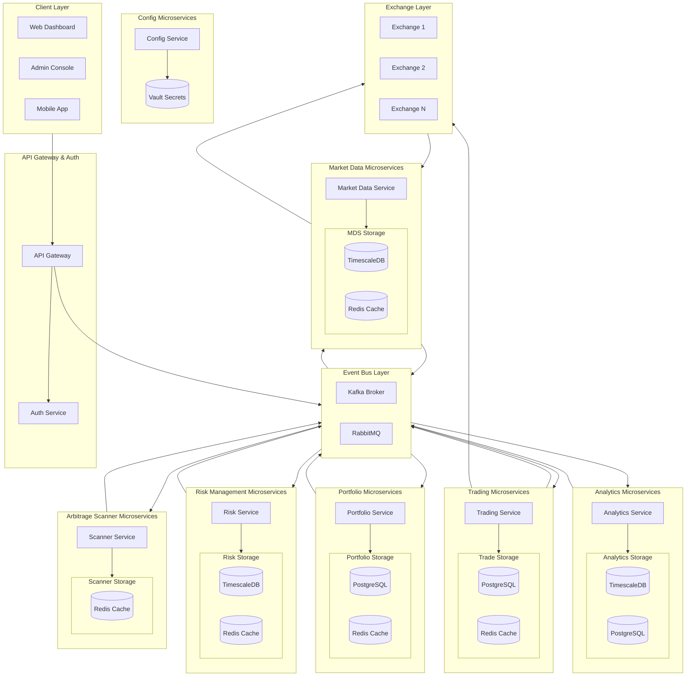
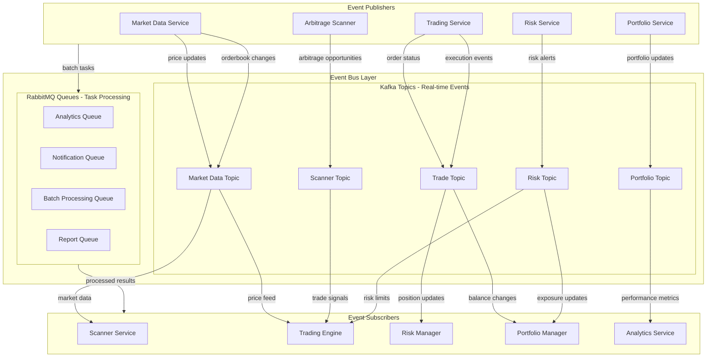
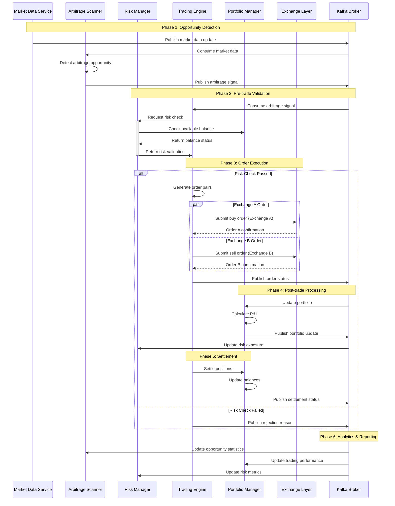
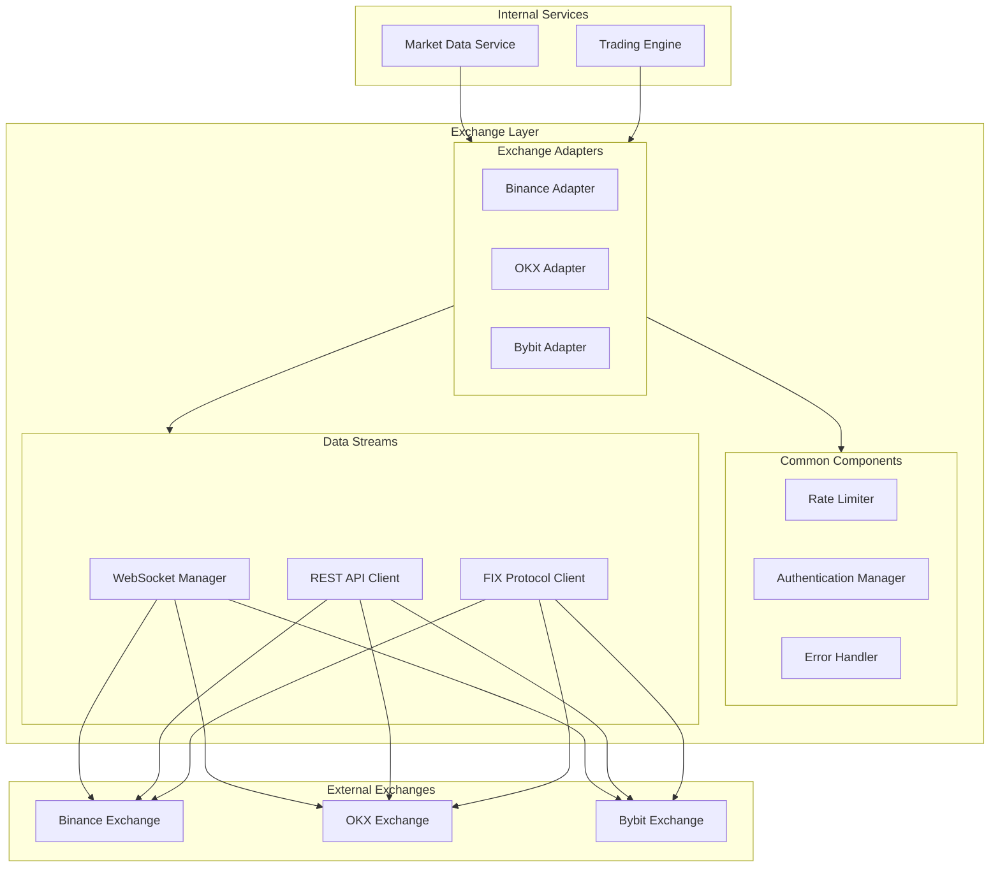

## PART 2: SYSTEM DESIGN

### 1. High-Level Architecture











### 2. Core Services Details

#### 2.1. Market Data Service
```
Purpose:
- Collect real-time market data
- Normalize data from multiple exchanges
- Process and store market data

Functions:
1. Data Collection
   - Websocket connections
   - Order book management
   - Trade data collection
   
2. Data Processing
   - Normalization
   - Aggregation
   - Clean up

3. Data Distribution
   - Real-time feeds
   - Historical data
   - Market metrics

Technology:
- Node.js/Go for websocket
- InfluxDB/TimescaleDB
- Redis pub/sub
- Apache Kafka
```

#### 2.2. Arbitrage Scanner
```
Purpose:
- Detect arbitrage opportunities
- Calculate profitability
- Assess feasibility

Functions:
1. Opportunity Detection
   - Spread calculation
   - Volume analysis
   - Market impact estimation
   
2. Profitability Analysis
   - Fee calculation
   - Slippage estimation
   - Net profit projection

3. Signal Generation
   - Trading signals
   - Priority ranking
   - Execution recommendations

Technology:
- Rust/Go for performance
- Redis streams
- Machine learning models
```

#### 2.3. Trading Engine
```
Purpose:
- Execute trades
- Manage trade lifecycle
- Optimize execution

Functions:
1. Order Execution
   - Smart order routing
   - Order splitting
   - Timing optimization
   
2. Position Management
   - Balance tracking
   - Position reconciliation
   - Settlement handling

3. Performance Optimization
   - Latency reduction
   - Order batching
   - Queue management

Technology:
- Rust/C++ for latency
- Redis/Aerospike
- FPGA for HFT
```

#### 2.4. Portfolio Management
```
Purpose:
- Manage investment portfolio
- Track portfolio performance
- Optimize capital allocation

Functions:
1. Balance Management
   - Asset tracking
   - Balance reconciliation
   - Rebalancing automation
   
2. Performance Analysis
   - ROI calculation
   - PnL tracking
   - Performance attribution

3. Capital Allocation
   - Buffer management
   - Position sizing
   - Fund distribution

Technology:
- PostgreSQL for data storage
- Python for analytics
- Redis for real-time tracking
```

#### 2.5. Configuration Management
```
Purpose:
- Manage system configuration
- Ensure consistency
- Control changes

Functions:
1. Config Storage & Validation
   - Version control
   - Schema validation
   - Config deployment
   
2. Environment Management
   - Multi-environment support
   - Variable resolution
   - Profile management

3. Security Management
   - Secret management
   - Access control
   - Audit logging

Technology:
- Vault for secret management
- Git for version control
- etcd/ZooKeeper for distributed config
```

#### 2.6. Risk Manager
```
Purpose:
- Manage real-time risk
- Enforce risk limits
- Monitor system

Functions:
1. Risk Calculation
   - Position risk
   - Market risk
   - Liquidity risk
   
2. Limit Management
   - Position limits
   - Loss limits
   - Exposure control

3. Alert System
   - Risk alerts
   - Limit breaches
   - System warnings

Technology:
- Python for risk models
- TimescaleDB
- Prometheus/Grafana
```

### 3. Performance Optimization

#### 3.1. Latency Optimization
```
1. Network
- Exchange co-location
- Direct market access
- Optimized network routes

2. Processing
- FPGA acceleration
- Kernel bypass
- Memory optimization

3. Database
- In-memory processing
- Data locality
- Query optimization
```

#### 3.2. Throughput Optimization
```
1. Parallel Processing
- Multi-threading
- Event-driven architecture
- Async processing

2. Data Management
- Data partitioning
- Cache strategies
- Buffer management

3. Resource Allocation
- Load balancing
- Resource pooling
- Queue prioritization
```

#### 3.3. Reliability Optimization
```
1. Fault Tolerance
- Service redundancy
- Data replication
- Failover systems

2. Error Handling
- Circuit breakers
- Retry mechanisms
- Graceful degradation

3. Monitoring
- Performance metrics
- Error tracking
- System health
```

### 4. Profit Optimization Based on KPIs

#### 4.1. Spread-based Optimization
```
1. Scanner Configuration
- Dynamic spread thresholds
- Market-specific filters
- Volume-based adjustments

2. Execution Strategy
- Smart order routing
- Timing optimization
- Fee optimization

3. Risk Management
- Dynamic position sizing
- Adaptive stop loss
- Exposure management
```

#### 4.2. Portfolio Optimization
```
1. Balance Management
- Dynamic rebalancing thresholds
- Buffer optimization
- Asset allocation strategies

2. Performance Enhancement
- Portfolio diversification
- Risk-adjusted returns
- Capital efficiency

3. Operational Optimization
- Rebalancing timing
- Transaction cost minimization
- Settlement efficiency
```

#### 4.3. Configuration Optimization
```
1. System Settings
- Performance tuning
- Resource allocation
- Timeout configurations

2. Trading Parameters
- Dynamic thresholds
- Market-specific settings
- Risk parameters

3. Environment Optimization
- Environment-specific tuning
- Service configuration
- Integration settings
```

#### 4.4. Market Impact Optimization
```
1. Order Execution
- Size optimization
- Order splitting
- Timing strategies

2. Liquidity Management
- Depth analysis
- Volume distribution
- Queue position

3. Cost Analysis
- Fee structure optimization
- Route optimization
- Settlement efficiency
```

### 5. Monitoring and Alerting

#### 5.1. Performance Monitoring
```
1. Business Metrics
- ROI tracking
- Win rate
- Profit per trade

2. Technical Metrics
- Latency
- Success rate
- Error rate

3. Risk Metrics
- Exposure levels
- Loss ratios
- Risk utilization
```

#### 5.2. Alert System
```
1. Trading Alerts
- Opportunity alerts
- Risk breaches
- Performance issues

2. System Alerts
- Service health
- Resource utilization
- Error conditions

3. Market Alerts
- Volatility changes
- Liquidity events
- Market conditions
```